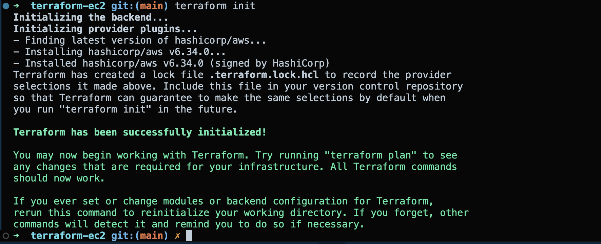
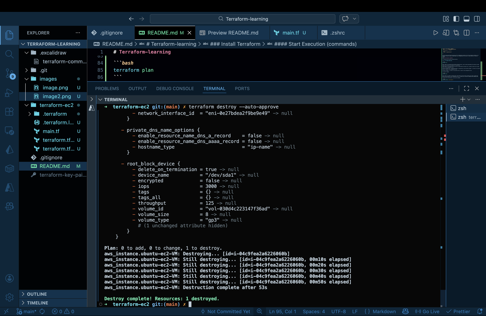
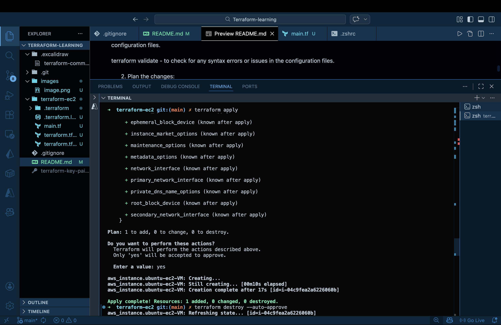

# Terraform-learning

Learning Terraform with AWS

what is terraform?

Terraform is an open-source infrastructure as code software tool created by HashiCorp. It allows users to define and provision data center infrastructure using a high-level configuration language known as HashiCorp Configuration Language (HCL), or optionally JSON. Terraform enables you to manage and version your infrastructure in a safe and efficient manner, making it easier to automate the provisioning and management of resources across various cloud providers and services. (aws, azure, google cloud, etc) single file for all different providers. (ec2 - aws, compute engine - google cloud, etc)

### Install Terraform

Using the brew as the package manager, you can install Terraform with the following command:

```bash
brew tap hashicorp/tap
brew install hashicorp/tap/terraform
```

#### Check if its really installed:

```bash
terraform -v
or
terraform version
```

###### How will the terraform knows who i am and if i am allowed to create the resources on Cloud provider like aws(ec2, s3), azure(vm, storage), gcp etc.?

I need to provide the credentials to terraform, so it can authenticate and authorize my actions on the cloud provider. This is typically done by setting environment variables or using a configuration file that contains the necessary credentials.

For example, if we are using AWS, you can set the following environment variables:

```bash
export AWS_ACCESS_KEY_ID=your_access_key_id
export AWS_SECRET_ACCESS_KEY=your_secret_access_key
```

Alternatively, we can use the AWS CLI to configure our credentials, which will create a configuration file that Terraform can use:

```bash
aws configure
```

In Terraform we use the language called HCL (HashiCorp Configuration Language) to define our infrastructure. We can create a file with a .tf extension (e.g., main.tf) and write our infrastructure code in it.

#### Example of a simple Terraform configuration to create an AWS EC2 instance:

```hcl
provider "aws" {
  region = "us-east-1"
}

resource "aws_instance" "example" {
  ami           = "ami-0c55b159cbfafe1f0"
  instance_type = "t2.micro"

  tags = {
    Name = "ExampleInstance"
  }
}
```

the access_key_id and secret_access_key will be automatically picked up from the environment variables we set earlier, so we don't need to include them in our configuration file, which is a best practice for security reasons.

#### Start Execution (commands)

1. Initialize the Terraform working directory:



```bash
terraform init
```

what it does: It initializes the Terraform working directory, which includes downloading the necessary provider plugins and setting up the backend for storing state.

Always good to run terraform fmt and terraform validate before terraform init, to make sure there are no syntax errors in the configuration files.

and also terraform fmt - to format the code in a consistent way, and terraform validate - to check for any syntax errors or issues in the configuration files.

terraform validate - to check for any syntax errors or issues in the configuration files.

2. Plan the changes:

```bash
terraform plan
```

what it does: It creates an execution plan, which shows you what actions Terraform will take to achieve the desired state defined in your configuration files. It allows you to review the changes before applying them.

to destroy the infrastructure, we can use the command:

```bash
terraform destroy --auto-approve
```


why --auto-approve?

The --auto-approve flag is used with the terraform destroy command to bypass the confirmation prompt that typically appears before destroying infrastructure. When you run terraform destroy, it will ask for confirmation to ensure that you really want to proceed with the destruction of resources. By using --auto-approve, you are telling Terraform to skip this confirmation step and proceed with the destruction immediately. This can be useful in automated scripts or when you are certain that you want to destroy the resources without needing an additional confirmation. However, it should be used with caution, as it can lead to unintended consequences if used in the wrong context.

3. Apply the changes:

```bash
terraform apply
```


